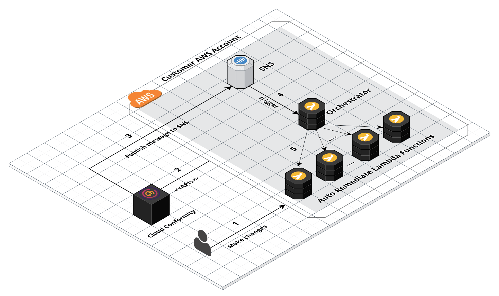

# Cloud Conformity Auto Remediation

## Disclaimer
This early "Auto Remediation" is subject to change. Cloud Conformity will use commercially reasonable efforts to support the previous version of the project.
This project is provided on an ‘AS IS’ and ‘WHEN AVAILABLE’ basis.  Cloud Conformity has no liability to user as a result of any changes made to their AWS infrastructure by installing this project.

Auto Remediation is an MIT open-source project, actively maintained by Cloud Conformity team.

## How it works

The following image shows how Cloud Conformity Auto Remediation works:



Here's an example:

1. A user makes an S3 bucket publicly readable via S3 Access Control Lists (ACLs)
2. Cloud Conformity identifies the risk in real-time
3. Cloud Conformity publishes a message to the specified SNS Topic
3. SNS topic triggers the Orchestrator lambda function which in turns calls S3 bucket auto-remediate function
4. S3 BucketPublicReadAccess Auto Remediate Function (AutoRemediateS3-001) updates the S3 bucket ACL and closes the security gap


## Installation
1. Go to the official [Serverless Framework](https://serverless.com/framework/docs/providers/aws/guide/installation/)  and follow the instructions to install the framework
2. Create a working copy of "Cloud Conformity Auto Remediation" repository by running the following command:
```bash
git clone https://github.com/cloudconformity/auto-remediate.git
```
3. Change directory to auto-remediation:

```bash
cd auto-remediate
```
4. `IMPORTANT` Update `functions/config.js` with required configurations. Please note that all the rules in config file are disabled by default to prevent unwanted changed. User needs to enabled the ones they need manually.
5. `IMPORTANT` Make any other necessary adjustments before deployment.
6. Run `npm install` before deploying so that the node_modules folder would be available to AWS

```bash
npm install
```
7. Finally deploy

```bash
serverless deploy --region us-west-2
```


## Message Format

The table below gives more information about SNS Message format:

| Name  | Values |
| ------------- | ------------- |
|  organisationId | Your Cloud Conformity Organisation Id |
|  accountId | Your Cloud Conformity Account Id |
|  accountName | Your Cloud Conformity Account Name |
|  service  | AutoScaling \| CloudFormation \| CloudFront \| CloudTrail \| CloudWatch \| CloudWatchEvents \|<br />CloudWatchLogs \| Config \| DynamoDB \| EBS \| EC2 \| ElastiCache \| Elasticsearch \| ELB \| IAM \|<br />KMS \| RDS \| Redshift \| ResourceGroup \| Route53 \| S3 \| SES \| SNS \| SQS \| VPC \| WAF \|<br />ACM \| Inspector \| TrustedAdvisor \| Shield \| EMR \| Lambda \| Support \| Organizations \|<br />Kinesis \| EFS<br /><br />For more information about services, please refer to [Cloud Conformity Services Endpoint](https://us-west-2.cloudconformity.com/v1/services) |
|  region  | global \| us-east-2 \| us-east-1 \| us-west-1 \| us-west-2 \| ap-south-1 \| ap-northeast-2 \|<br />ap-southeast-1 \| ap-southeast-2 \| ap-northeast-1 \| ca-central-1 \| eu-central-1 \| eu-west-1 \|<br /> eu-west-2 \| sa-east-1 <br /><br />For more information about regions, please refer to [Cloud Conformity Region Endpoint](https://us-west-2.cloudconformity.com/v1/regions) |
|  id | Check Id |
|  resource | AWS Resource |
|  ccrn | Cloud Conformity Resource Name |
|  ruleId  | e.g. S3-001 <br /><br />For more information about rules, please refer to [Cloud Conformity Services Endpoint](https://us-west-2.cloudconformity.com/v1/services) |
|  ruleTitle  | e.g. BucketPublicReadAccess <br /><br />For more information about rules, please refer to [Cloud Conformity Services Endpoint](https://us-west-2.cloudconformity.com/v1/services) |
|  statuses | SUCCESS \| FAILURE |
|  categories  | security \| cost-optimisation \| reliability \| performance-efficiency  \| operational-excellence <br /><br />For more information about categories, please refer to [Cloud Conformity Services Endpoint](https://us-west-2.cloudconformity.com/v1/services) |
|  riskLevels  | LOW\| MEDIUM \| HIGH \| VERY_HIGH \| EXTREME <br /><br />For more information about risk levels, please refer to [Cloud Conformity Services Endpoint](https://us-west-2.cloudconformity.com/v1/services) |
|  message  | e.g. Bucket my-bucket-name allows public 'READ' access |
|  createdDate  | The date when the check was created<br /><br />The numeric value of the specified date as the number of milliseconds since January 1, 1970, 00:00:00 UTC |
|  failureDiscoveryDate  | The date when the check the failure was discovered<br /><br />The numeric value of the specified date as the number of milliseconds since January 1, 1970, 00:00:00 UTC |
|  tags  | Any assigned metadata tags to your AWS resources |


## Auto Remediate Functions

The table below lists the supported auto auto-remediate functions:

| Service  | Rule Id | Description |
| ------------- | ------------- | ------------- |
|  CloudFormation | [CFM-005](https://www.cloudconformity.com/conformity-rules/CloudFormation/stack-termination-protection.html)    | Ensure Termination Protection feature is enabled for your AWS CloudFormation stacks |
|  Config | [Config-001](https://www.cloudconformity.com/conformity-rules/Config/aws-config-enabled.html)    | Ensure AWS Config is enabled in all regions |
|  S3  | [S3-001](https://www.cloudconformity.com/conformity-rules/S3/s3-bucket-public-read-access.html) | Ensure S3 buckets do not allow public READ access |
|  S3  | [S3-012](https://www.cloudconformity.com/conformity-rules/S3/s3-bucket-versioning-enabled.html) | Enable versioning for AWS S3 buckets |
|  RDS | [RDS-008](https://www.cloudconformity.com/conformity-rules/RDS/rds-publicly-accessible.html)    | Ensure RDS instances are not public facing to minimise security risks |
|  CloudTrail | [CT-001](https://www.cloudconformity.com/conformity-rules/CloudTrail/cloudtrail-enabled.html)    | Ensure CloudTrail API logging is activated for all Regions |
|  Redshift | [RS-001](https://www.cloudconformity.com/conformity-rules/Redshift/redshift-cluster-publicly-accessible.html)    | Ensure Redshift clusters are not publicly accessible to minimise security risks |
|  IAM | [IAM-001](https://www.cloudconformity.com/conformity-rules/IAM/access-keys-rotated-30-days.html)    | Ensure that all your IAM user access keys are rotated every month  |
|  EC2 | [EC2-002](https://www.cloudconformity.com/conformity-rules/EC2/unrestricted-ssh-access.html)    | Ensure that there is no unrestricted access through TCP port 22 from the selected EC2 security group  |
|  EC2 | [EC2-005](https://www.cloudconformity.com/conformity-rules/EC2/unrestricted-mysql-access.html)    | Ensure that there is no unrestricted access through TCP port 3306 (which is used by MYSQL Database Server) from the selected EC2 security group  |

For more information about `Rule Id`, please refer to [Cloud Conformity Services Endpoint](https://us-west-2.cloudconformity.com/v1/services)

## How to contribute

You are welcome to contribute to "Cloud Conformity Auto Remediation"

1. [Fork](https://help.github.com/articles/fork-a-repo/) the project
2. Make a well commented and clean commit to the repository
3. Create a [pull request](https://help.github.com/articles/about-pull-requests/)

## Styleguide

The styleguide used for this project is
[Standard](https://standardjs.com/) forced by [eslint](https://github.com/eslint/eslint).
To run eslint, you only need to run `npm run lint [filename]` or to
run for the whole project, run `npm run lint '**/*.js'`.
Refer to package.json for more info.

The main rules are as follows:
* 2 spaces – for indentation
* Single quotes for strings – except to avoid escaping
* No unused variables – this one catches tons of bugs!
* No semicolons – It's fine. Really!
* Never start a line with (, [, or `
* Space after keywords if (condition) { ... }
* Space after function name function name (arg) { ... }
* Always use === instead of == – but obj == null is allowed to check null || undefined.
* Always handle the node.js err function parameter
* Always prefix browser globals with window – except document and navigator are okay
